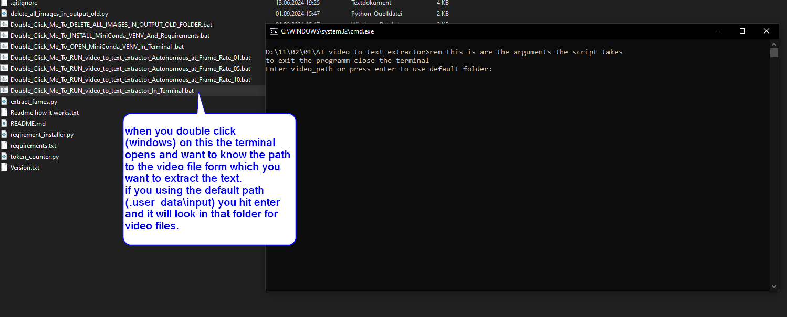
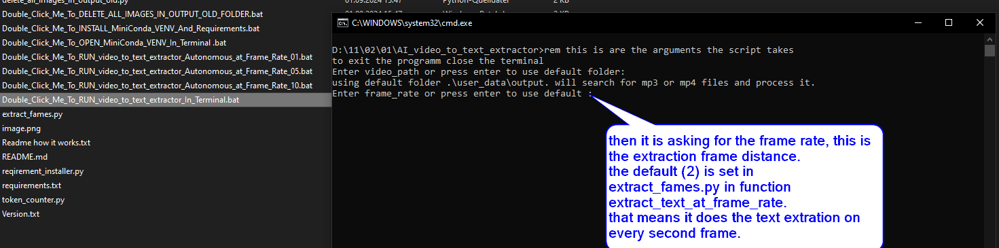

# AI_video_to_text_extractor
this tool extracts all text from a video and saves it to a text file.
this is tested on windows.

It works with pytesseract to get the text out of the images.
First Tesseract need to be installed on your system
you can download it from here as a windows installer
...

or take a complete (no installation pack from here) this is a zip file where everything is already included (tesseract and the needed scripts to run it)
https://drive.usercontent.google.com/download?id=1HUTPFedFiRulXveljQKp5yJNnTgkAuYF&export=download&authuser=0&confirm=t&uuid=b1f61fbe-a7dd-44e3-ae74-6918d08579c0&at=AO7h07eoNys3JWpyjVCj5o3eZ9Xu:1725203775527

for that reasons it need ot be installed
for that i created a Double_Click_Me_To_INSTALL_MiniConda_VENV_And_Requirements.bat
this (only on windows) will download a loacal standalone miniconda and creates a 
installer_files folder where it then installs the Requirements.txt into a virtual environment
including tesseract.

to run image to text  you can use the 
Double_Click_Me_To_RUN_video_to_text_extractor_In_Terminal.bat

this is what then (should) happen

here you can choose the frame rate of the text extraction:
lets say you have a video file with a frame rate of 30 frames per second (fps).
and you set the frame_rate to 5,
it will extract frame 1 ,6,11,16....

If you downlaoded the complete package you can run the 
Double_Click_Me_To_RUN_video_to_text_extractor_In_Terminal.bat

make sure you putted the video file into the input folder before you run the bat file
D:\69\video_to_text_extractor\input
after the process is completed the results you will find in the output folder
D:\69\video_to_text_extractor\output

