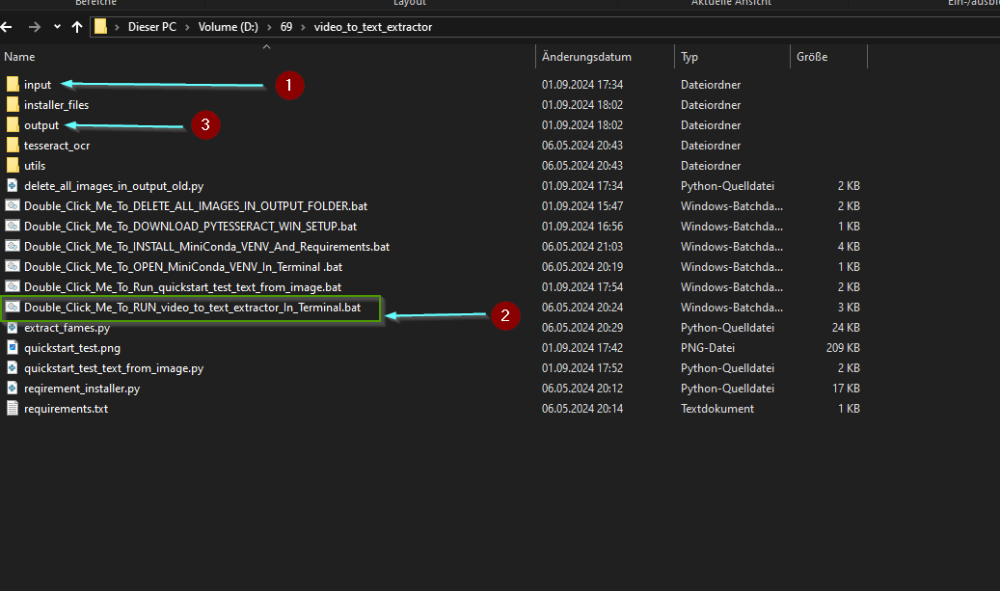
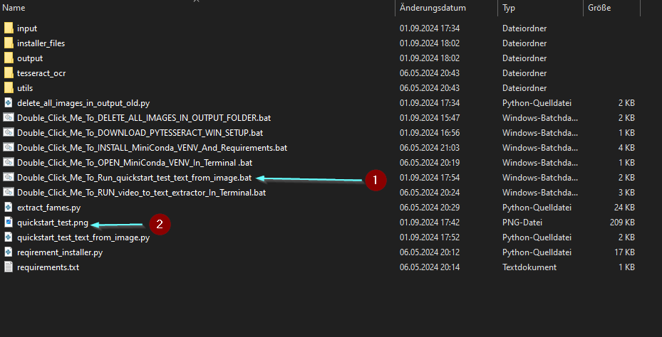

# AI_video_to_text_extractor
this tool extracts all text from a video and saves it to a text file.
this is tested on windows.
This code is just a user of the program you need to install first on your system 
the progamm is called tesseract
see here:
https://github.com/tesseract-ocr/tesseract

This was tested only on windows 10
to install it i used this compiled exe version from the UB Mannheim (German university)
https://github.com/UB-Mannheim/Tesseract_Dokumentation/blob/main/Tesseract_Doku_Windows.md

there i found the download link for the installer (Windows)
https://digi.bib.uni-mannheim.de/tesseract/

this is the download link for version 5.2 as a windows installer.
https://digi.bib.uni-mannheim.de/tesseract/tesseract-ocr-w64-setup-v5.2.0.20220712.exe

then the installation need to be added to the systems environment variables
for that go to the windows search field ant type 'path'
the should apperar environment variables click on it and search for Path and add
the path where you installed tesseract to it.
"D:\69\tesseract.exe"
It works with pytesseract to get the text out of the images.
First Tesseract need to be installed on your system
you can download it from here as a windows installer
...

or take a complete (no installation pack from here) this is a zip file where everything is already included (tesseract and the needed scripts to run it)
https://drive.usercontent.google.com/download?id=1HUTPFedFiRulXveljQKp5yJNnTgkAuYF&export=download&authuser=0&confirm=t&uuid=b1f61fbe-a7dd-44e3-ae74-6918d08579c0&at=AO7h07eoNys3JWpyjVCj5o3eZ9Xu:1725203775527

to run image to text  you can use the 
Double_Click_Me_To_RUN_video_to_text_extractor_In_Terminal.bat

this is what then (should) happen

here you can choose the frame rate of the text extraction:
lets say you have a video file with a frame rate of 30 frames per second (fps).
and you set the frame_rate to 5,
it will extract frame 1 ,6,11,16....

If you downlaoded the complete package you can run the 
Double_Click_Me_To_RUN_video_to_text_extractor_In_Terminal.bat (2)

make sure you putted the video file into the input folder before you run the bat file (1)
D:\69\video_to_text_extractor\input
after the process is completed the results you will find in the output folder (3)
D:\69\video_to_text_extractor\output

there is also a test script for extracting text from a image 
to test it you can run Double_Click_Me_To_Run_quickstart_test_text_from_image.bat (1) (just double click on it in the windows explorer) (that should open a terminal)
this bat file opens the python virtual environment inside the installer_files folder 
the it runs the quickstart_test_text_from_image.py
you should see the text from the quickstart_test.png (2)
printed out in the terminal

